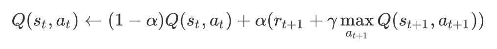

<!-- $theme: gaia -->
<!-- footer: AIロボットを作ろう -->
<!-- page_number: true -->
<!-- template: invert -->

# バランスロボット
# :robot:
##### Group 2
###### 林 雅也
###### 笹谷 拓

---

# モーター1つでバランスを取るロボット

---

# 仕様

- モーターにタイヤを2つ
- ジャイロセンサ
- Q学習を用いて学習

---

# 状態 - States

- ジャイロセンサの角度`angle`と角速度`rate`を離散化
  - `0 < angle < 180`を取りうる
  - `70 < angle < 110`を5°ずつ離散化
  - `70 < angle < 110`から出ると失敗
  - `rate`についてはうまく扱えず

---

# 行動 - Actions

- 「進む」、「下がる」、「止まる」の3つ

# Q値

- 状態100 × 行動3 = 300通り
- Q値を保持する配列 : `float[100][3] Q`

---

# Reward

- 前ステップよりも中心の`90°`に近づく
  - 正の`reward`を与える
- 中心から離れる
  - 負の`reward`を与える

---

# Qの更新

- 今回の問題では、次の状態と行動によるQ値を把握できなかった
- 今のQ値を用いて1つ前のQ値を更新するようにした
- `alpha = 0.2`, `gamma = 0.99`

---

# 今後の課題

- リセットの方法
- そのステップでの価値ではなく、エピソード終了時の報酬を最大化する方法
- ジャイロセンサの角速度を有効活用
- ジャイロセンサの精度
- Actionsの種類を増やす
